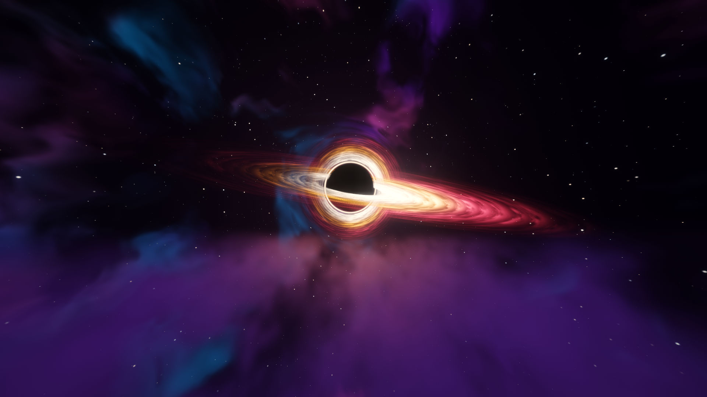

# RustingShader

**A cinematic Iris shader pack for Minecraft, with a black hole in the End.**

Soft PCSS shadows, deferred water with reflections and caustics, volumetric
clouds and light, a real phased moon, and an End that looks like the last place
in the universe. Plain GLSL 1.20, no build step: drop the folder in and play.

<!-- Screenshots: put F2 shots in docs/images/ and link them here, e.g.
 -->

## What is included

**Glow**
- Every light source gets a soft colored halo from its own emission buffer, tight neon edge plus wide bloom
- Redstone glows: dust (brighter with more power), blocks, torches, lit ore, powered repeaters, comparators and observers
- Furnace and candle flames, crystals, sculk, glow berries, Nether portal, copper bulbs, froglights
- Glowing mobs (blazes, glow squids, allays, End crystals), spider and enderman eyes, beacon beams, flame particles
- Held and dropped light items glow; holding a torch lights up the area around you
- Gems in ores sparkle a little (can be turned off)

**Overworld**
- Deferred lighting with PCSS soft shadows, warm torch light and glowing emissive blocks
- Waving plants and leaves
- Volumetric clouds that cast shadows on the ground
- Volumetric light (god rays), ground fog in valleys, aurora on clear nights
- Round moon with real phases, maria, craters and earthshine
- Softer, desaturated rain instead of the blue streaks
- Rain soaks the world: ground darkens, puddles form in the dips and reflect the sky, drops ring on water and puddles

**Water**
- Animated waves, refraction, screen-space reflections with sky fallback
- Shoreline foam and caustics
- Underwater: Snell's window, light shafts, depth-based absorption

**Nether**
- Full support with its own fog and lighting

**End**
- A gravitationally lensed black hole: photon ring, tilted accretion disk with
  Kepler rotation and Doppler beaming, and the far side of the disk bent over
  the top of the horizon
- Volumetric smoke drifting between the islands
- Two styles, switchable in settings:
  - **Empty** (default): almost colorless, infinitely deep, quiet. Horror at the end of everything.
  - **Colored**: violet nebulae and a dense starfield.

**Post**
- Bloom, auto exposure, lens flare, ACES tonemap, color grading, vignette

## Requirements

- Minecraft Java Edition with [Iris](https://irisshaders.dev/) (tested on Iris 1.11.6 + Sodium 0.9.3, Minecraft 26.3)
- A GPU that handles OpenGL 3.x shader packs comfortably. Developed on an RTX 3060.

## Installation

1. Install [Iris](https://modrinth.com/mod/iris) (with Sodium).
2. Download `RustingShader-vX.Y.zip` from the
   [Releases](https://github.com/GoingRusting/RustingShader/releases) page and put it,
   **still zipped**, into `.minecraft/shaderpacks/`.
   (The green "Code → Download ZIP" button does not work directly: it wraps
   everything in an extra folder, so Iris cannot find `shaders/`.)
3. In game: Options → Video Settings → Shader Packs → **RustingShader**.

Press **R** in game (Iris reload key) after editing a shader.

## Settings

Everything is in the in-game shader menu, grouped into screens: shadows,
lighting, water, clouds, sky, post-processing, and End. Defaults live in
[`shaders/lib/settings.glsl`](shaders/lib/settings.glsl).

Most useful knobs:

| Setting | What it does |
|---|---|
| `END_STYLE` | Empty (horror, colorless) or Colored (nebulae) End |
| `BH_SIZE`, `BH_SPIN`, `BH_BRIGHTNESS` | Black hole size, disk rotation speed, disk brightness |
| `END_SMOKE_HEIGHT`, `END_SMOKE_DENSITY` | Where and how thick the End smoke is |
| `GLOW_STRENGTH`, `EMISSIVE_STRENGTH` | Halo size around lights, brightness of glowing pixels |
| `SHADOW_SOFTNESS` | Contact-hardening shadow blur |
| `CLOUD_COVERAGE`, `CLOUD_STEPS` | Cloud amount and quality (steps cost the most) |
| `VL_STEPS` | God ray quality |
| `MOON_SIZE`, `MOON_BRIGHTNESS` | Custom moon |
| `RAIN_OPACITY` | How visible rain is |
| `PUDDLES`, `PUDDLE_AMOUNT` | Reflective rain puddles and how much ground they cover |

On a weaker GPU, lower `CLOUD_STEPS`, `VL_STEPS` and `shadowMapResolution` first.

## Development

```
shaders/
  lib/         shared code: settings, noise, sky, shadows, clouds, End
  program/     the real pass code
  *.fsh/*.vsh  thin wrappers that #define flags and #include a program
  world-1/     Nether wrappers (NO_SKY)
  world1/      End wrappers (NO_SKY + END)
tools/
  check.py     compiles every program in every dimension with glslangValidator
  preview.py   renders the End sky to a PNG on the GPU (moderngl)
  glowtest.py  renders the glow halo on a test image, same code as in game
```

```sh
python3 tools/check.py            # prints "all OK" or the failing program
python3 tools/preview.py out.png  # needs moderngl, numpy, pillow
```

A detailed guide in Russian, covering the pipeline, how to add effects, and
common pitfalls, is in [`docs/GUIDE.ru.md`](docs/GUIDE.ru.md).

## License

RustingShader is released under the [RustingShader License 1.0](LICENSE.md).
You may use, modify and redistribute it, including in modpacks and commercial
content, as long as you keep the license and credit the original author.
